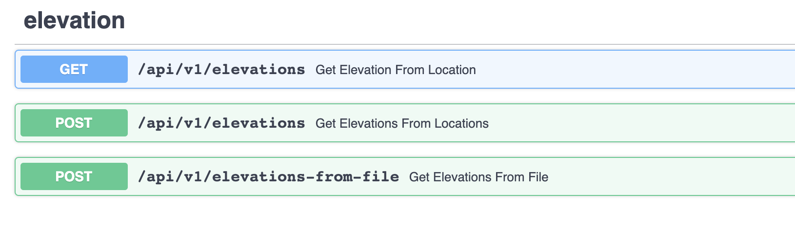
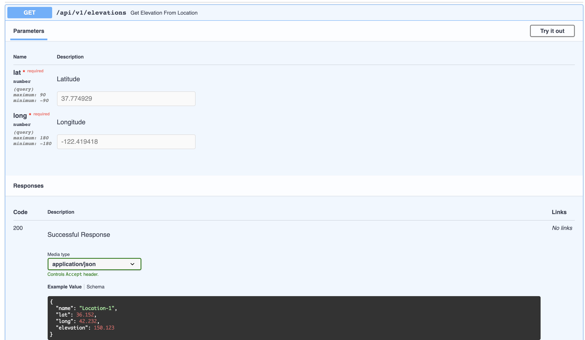
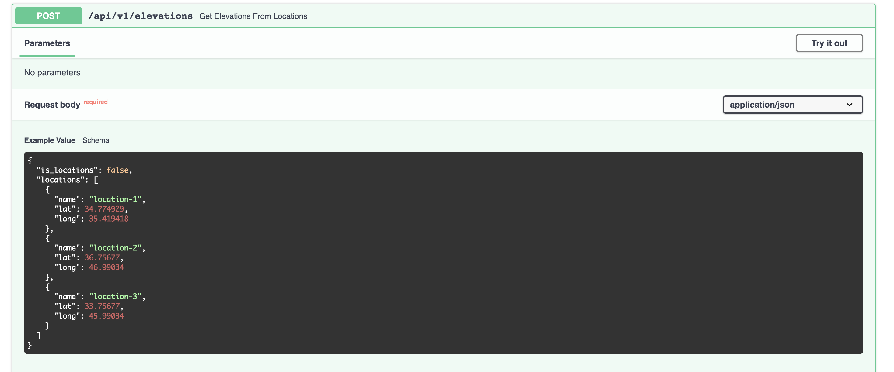
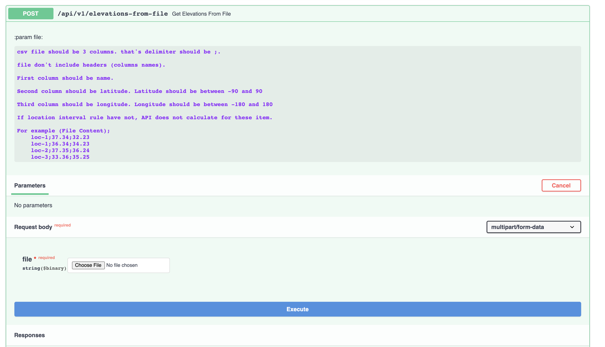

# Random Elevation API with FastAPI
With custom FastAPI template, you can get random elevations from single multiple, and csv file
## Build
From your project directory, start up your application by running

Firstly create a env file
```bash
cp default.env .env
```
After
```bash
docker-compose up
```

## Usage

After Build you can reach swagger docs from below URL;

```
http://127.0.0.1:9998/
```
#### Examples








